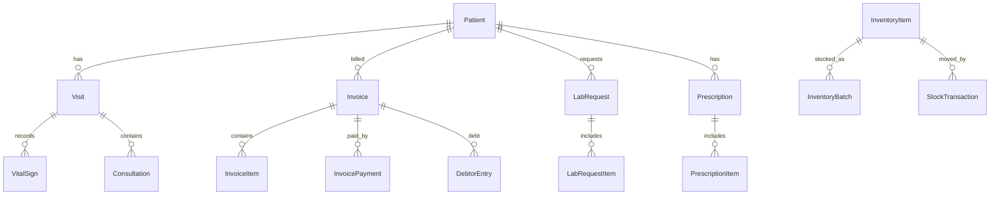

# HMS Refactoring Map

Date: 2026-08-08

This document is a discovery-only map of the current Hospital Management System codebase. It is based on direct inspection of the repository and is intentionally conservative about anything that could not be verified.

## 1. Executive Summary

- Current architecture: a layered ASP.NET Core 8 solution with a separate API host and MVC UI host. The API contains most domain logic and persistence. The UI is a server-rendered MVC/BFF-style front end that calls the API through an internal `ApiClient`.
- Primary technologies: ASP.NET Core MVC, EF Core 8, SQL Server, JWT bearer auth, cookie-based UI session handling, Bootstrap 5, Bootstrap Icons, Serilog, SignalR, optional Redis cache.
- Approximate size: 2 web projects, 2 test projects, 436 repository files total, 368 app/code files in the main source areas, and 15 test files.
- Major modules found: auth, tenants, users/roles/permissions, patient registration and visit flows, consultation, vitals, billing, payments, laboratory, pharmacy, inventory, profile management, reporting, sync, subscriptions, diagnostics, logs, notifications.
- Current strengths: clear service-layer separation in the API, DTO-based boundaries, permission-based authorization in the API, centralized tenant scoping, reusable patient header partials, working patient/billing/lab/pharmacy flows, and some integration testing.
- Major weaknesses: no centralized design system, some large services/controllers, mixed response styles, scattered UI orchestration, many silent catches, missing clinical domains from the requirements, and only partial patient-chart/patient-360 support.
- Major architectural risks: ambient tenant state, dev/admin endpoints with destructive capability, some internal data exposure endpoints, repeated per-item query enrichment, and incomplete auditing for clinical history.
- Major UX risks: the UI is mostly module/CRUD-oriented rather than patient/workflow-oriented, there is no role-specific dashboard system, and patient context is not persistently visible across all clinical tasks.

## 2. Technology Stack

### Frontend

- Framework: ASP.NET Core MVC and Razor Pages in `HMS.UI`
- Version: .NET 8.0, confirmed in `HMS.UI/HMS.UI.csproj`
- UI library: Bootstrap 5.3.3, Bootstrap Icons 1.11.3, Toastr
- State management: server-rendered views and cookies; no client state framework found
- Routing: MVC controller routes plus Razor Pages routes in `HMS.UI/Program.cs`
- Form libraries: ASP.NET Core tag helpers, model binding, `jquery-validation` partial, antiforgery helpers
- Styling system: custom CSS in `HMS.UI/wwwroot/css/hms-portal.css`, plus separate login/home CSS files
- Build system: standard .NET/MSBuild; no Vite/Webpack/Tailwind config found

Where used:
- `HMS.UI/Program.cs`
- `HMS.UI/Views/Shared/_Layout.cshtml`
- `HMS.UI/wwwroot/css/hms-portal.css`
- `HMS.UI/Views/Patients/*`
- `HMS.UI/Views/Pharmacy/*`
- `HMS.UI/Views/Billing/*`

### Backend

- Framework: ASP.NET Core Web API in `HMS.API`
- Version: .NET 8.0, confirmed in `HMS.API/HMS.API.csproj`
- API architecture: controller-based API with attribute routing, service layer, DTOs, middleware, and SignalR hub
- ORM/data access: Entity Framework Core 8 against SQL Server
- Authentication: JWT bearer auth, with cookie transport for browser sessions
- Authorization: permission-based policies via `HasPermissionAttribute`, `PermissionPolicyProvider`, and `PermissionAuthorizationHandler`

Where used:
- `HMS.API/Program.cs`
- `HMS.API/Controllers/*`
- `HMS.API/Application/*`
- `HMS.API/Infrastructure/*`
- `HMS.API/Security/*`

### Database

- Database engine: SQL Server
- Version: not identifiable from code
- ORM: Entity Framework Core
- Migration mechanism: EF Core migrations in `HMS.API/Infrastructure/Auth/Migrations` and `HMS.API/Infrastructure/Persistence/Migrations`

Where used:
- `HMS.API/Infrastructure/Auth/AuthDbContext.cs`
- `HMS.API/Infrastructure/Persistence/HmsDbContext.cs`
- `HMS.API/Program.cs`

### Infrastructure

- Hosting/deployment information: Kestrel binds HTTP and HTTPS in `HMS.API/Program.cs`; no Docker files found
- Containers: not discovered
- Background workers: outbox processor, reservation cleanup, background sync, reporting aggregator
- External services: optional Redis cache, Serilog MSSQL sink, SignalR, file uploads under `wwwroot/uploads`, `RabbitMQ.Client` package reference present but no clear active usage found in inspected code
- Messaging: outbox pattern plus SignalR notification hub
- File storage: local filesystem under `HMS.API/wwwroot/uploads` and `HMS.API/wwwroot/data`

Where used:
- `HMS.API/Program.cs`
- `HMS.API/Infrastructure/Outbox/OutboxProcessor.cs`
- `HMS.API/Infrastructure/Sync/*`
- `HMS.API/Hubs/NotificationHub.cs`
- `HMS.API/wwwroot/uploads/*`

## 3. Solution / Project Structure

```text
/
  HospitalManagementSystem.sln
  HMS.API/                       API host and domain logic
  HMS.UI/                        MVC UI host
  HMS.API.Tests/                 Unit tests
  HMS.API.IntegrationTests/       Integration tests
  docs/                          Architecture and module notes
  scripts/                       Migration helper docs
  README.md, CONTRIBUTING.md, AGENTS.md
```

Important directories:

- `HMS.API/Application`: service layer, DTOs, module orchestration
- `HMS.API/Controllers`: HTTP endpoints
- `HMS.API/Domain`: entities, value objects, enums
- `HMS.API/Infrastructure`: EF Core, auth persistence, reporting, sync, outbox, logging
- `HMS.API/Middleware`: tenant resolution, response wrapping, diagnostics
- `HMS.API/Security`: permission authorization infrastructure
- `HMS.UI/Controllers`: MVC application entry points that call the API
- `HMS.UI/Views`: Razor UI for patients, billing, lab, pharmacy, profiles, users, roles
- `HMS.UI/Models`: UI view models and DTO shapes
- `HMS.UI/wwwroot/css`: custom portal styling
- `docs`: repository-maintained architecture notes that were used as a cross-check

## 4. Module Inventory

| Module | Exists? | Main Location | Key Files | Status | Notes |
| --- | --- | --- | --- | --- | --- |
| Authentication | Yes | `HMS.API/Application/Auth`, `HMS.API/Controllers/AuthController.cs`, `HMS.API/Infrastructure/Auth` | `AuthService.cs`, `AuthDbContext.cs`, `SeedData.cs` | COMPLETE | JWT login/refresh/logout, password recovery, change-password, seed data. |
| Users | Yes | `HMS.API/Application/Auth`, `HMS.API/Controllers/UsersController.cs`, `HMS.UI/Controllers/UsersController.cs` | `UserManagementService.cs`, `UserManagementDtos.cs` | COMPLETE | User CRUD, role assignment, lock/unlock, password reset. |
| Roles | Yes | `HMS.API/Controllers/RolesController.cs`, `HMS.UI/Controllers/RolesController.cs` | `RoleDtos.cs`, `Role.cs` | COMPLETE | Role CRUD and permission assignment. |
| Permissions | Yes | `HMS.API/Domain/Auth/Permission.cs`, `HMS.API/Security` | `PermissionRequirement.cs`, `PermissionPolicyProvider.cs` | COMPLETE | Atomic permission codes drive authorization. |
| Tenants | Yes | `HMS.API/Controllers/TenantsController.cs`, `HMS.API/Infrastructure/Auth` | `Tenant.cs`, `TenantDomain.cs`, `TenantSubscription.cs` | COMPLETE | Tenant discovery, tenant token issuing, local defaults, diagnostics. |
| Subscriptions | Yes | `HMS.API/Controllers/SubscriptionsController.cs`, `HMS.API/Application/Common` | `TenantSubscriptionService.cs` | COMPLETE | Subscription create/update/cancel/webhook. |
| Patients | Yes | `HMS.API/Application/Patient`, `HMS.API/Controllers/PatientsController.cs`, `HMS.UI/Controllers/PatientsController.cs` | `PatientService.cs`, `Patient.cs`, `PatientDtos.cs` | COMPLETE | Registration, search, duplicates, merge, visits, vitals, consultation. |
| Registration | Partial | `HMS.UI/Controllers/PatientsController.cs`, `HMS.UI/Views/Patients/Create.cshtml` | `RegisterPatientRequest`, `Create.cshtml` | PARTIAL | Patient registration exists; no standalone registration queue/workflow module. |
| Appointments | No | Not found | None | MISSING | No appointment entity/controller/service found. |
| Queue | No | Not found | None | MISSING | No real queue module found. |
| Triage | No | Not found | None | MISSING | No triage workflow found. |
| Consultation | Yes | `HMS.API/Application/Patient`, `HMS.API/Controllers/PatientsController.cs` | `Consultation.cs`, `ConsultationDtos.cs` | PARTIAL | Consultation notes exist, but no draft/sign/finalize/history model. |
| Clinical Notes | Partial | `HMS.API/Domain/Patient/Consultation.cs`, `HMS.UI/Views/Patients/ConsultationDetails.cshtml` | same | PARTIAL | Notes are embedded in consultation records, not a full note system. |
| Diagnoses | Partial | `HMS.API/Domain/Patient/Consultation.cs`, `HMS.UI/Views/Patients/VisitDetails.cshtml` | `DiagnosisCodes` string | PARTIAL | Free-text/coded string only, no structured diagnosis module. |
| Problems | No | Not found | None | MISSING | No active problem list entity/service found. |
| Allergies | Partial | `HMS.API/Domain/Patient/Patient.cs` | patient fields only | PARTIAL | Requirements mention allergies, but no allergy entity/module found. |
| Medications | Partial | `HMS.API/Application/Pharmacy` | `Prescription.cs`, `PrescriptionItem.cs` | PARTIAL | Prescription/dispense exists, but not a standalone medication history module. |
| Prescriptions | Yes | `HMS.API/Application/Pharmacy`, `HMS.API/Controllers/PharmacyController.cs` | `PharmacyService.cs` | COMPLETE | Create, update, reconcile, dispense, note, charge. |
| Pharmacy | Yes | `HMS.API/Application/Pharmacy`, `HMS.API/Controllers/PharmacyController.cs` | `InventoryService.cs`, `PharmacyReportService.cs` | COMPLETE | Inventory, batches, procurement, dispensing, reports. |
| Laboratory | Yes | `HMS.API/Application/Lab`, `HMS.API/Controllers/LabController.cs` | `LabService.cs`, `LabRequest.cs` | COMPLETE | Tests, requests, results, verification, attachments. |
| Radiology | No | Not found | None | MISSING | No imaging request/report module found. |
| Admissions | No | Not found | None | MISSING | No admission entity/service/controller found. |
| Wards | No | Not found | None | MISSING | No ward management module found. |
| Beds | No | Not found | None | MISSING | No bed management module found. |
| Nursing | No | Not found | None | MISSING | No nursing task workflow found. |
| Discharge | No | Not found | None | MISSING | No discharge workflow found. |
| Billing | Yes | `HMS.API/Application/Billing`, `HMS.API/Controllers/BillingController.cs` | `BillingService.cs`, `Invoice.cs`, `DebtorEntry.cs` | COMPLETE | Invoices, debts, aging, payment application, exports. |
| Payments | Yes | `HMS.API/Application/Payments`, `HMS.API/Controllers/PaymentsController.cs` | `PaymentService.cs`, `Payment.cs`, `Receipt.cs` | COMPLETE | Payments, receipts, refunds, refund reversals. |
| Insurance | Partial | `HMS.API/Domain/Patient/Patient.cs`, `HMS.UI/Views/Patients/*` | patient fields only | PARTIAL | Insurance data is stored on patient records only; no insurance module. |
| Inventory | Yes | `HMS.API/Application/Pharmacy/InventoryService.cs`, `HMS.API/Controllers/Inventory/*` | `InventoryItem.cs`, `InventoryBatch.cs` | COMPLETE | Stock, units, stores, suppliers, conversions, receive goods. |
| Procurement | Yes | `HMS.API/Controllers/Pharmacy/ProcurementController.cs` | procurement DTOs | COMPLETE | Purchase orders and receiving exist. |
| Staff | Partial | `HMS.API/Domain/Profile/UserProfile.cs`, `HMS.API/Application/Profile/ProfileService.cs` | `UserProfile.cs` | PARTIAL | Staff/profile metadata exists, but not a full HR module. |
| Reports | Yes | `HMS.API/Controllers/Reports/*`, `HMS.UI/Controllers/ReportsController.cs` | report services | COMPLETE | Patient, billing, lab, pharmacy, profile, admin reporting. |
| Notifications | Yes | `HMS.API/Hubs/NotificationHub.cs`, `HMS.API/Controllers/NotificationController.cs` | `NotificationService.cs` | PARTIAL | SignalR and notification retrieval exist; full notification UX is limited. |
| Documents | Partial | `HMS.API/wwwroot/uploads`, `HMS.UI/Views/Patients/VisitDetails.cshtml` | attachment upload paths | PARTIAL | Lab result attachments and profile photos exist; no document management module. |
| Audit | Yes | `HMS.API/Domain/*Audit.cs`, `HMS.API/Infrastructure/Logging` | `AuthAudit.cs`, `BillingAudit.cs`, `InventoryAudit.cs`, `LogEntry.cs` | PARTIAL | Good operational audit coverage, weak clinical history audit. |
| Configuration | Yes | `HMS.API/Application/Common/AppSettingsService.cs`, `HMS.API/Controllers/AppSettingsController.cs` | app settings, tenants, static data | COMPLETE | App settings, deployment mode, static lookups. |
| Sync | Yes | `HMS.API/Application/Sync`, `HMS.API/Infrastructure/Sync` | `SyncManager.cs`, `BackgroundSyncService.cs` | COMPLETE | Tenant sync, cloud client, push notifier, background sync. |
| Diagnostics/Debug | Yes | `HMS.API/Controllers/DebugController.cs`, `HMS.API/Controllers/DiagnosticsController.cs`, `HMS.API/Controllers/LogsController.cs` | debug/admin controllers | COMPLETE | Diagnostics are present, but should be treated as high risk. |

## 5. User Roles

### Roles verified in seed data

| Role name | Where defined | Permissions | Frontend restrictions | Backend restrictions | Dashboard | Accessible modules | Known gaps |
| --- | --- | --- | --- | --- | --- | --- | --- |
| System Administrator | `HMS.API/Infrastructure/Auth/SeedData.cs`, `HMS.API/Infrastructure/Auth/RoleCatalog.cs` | Users, roles, security, integrations, tenant settings, clinical, billing, lab, pharmacy, inventory, finance, reporting, and audit permissions | UI hides edit/delete for built-in roles | API blocks editing, deleting, or re-permissioning built-ins | Admin overview + role/permission admin | Broad system administration | No dedicated system admin landing page yet. |
| Hospital Administrator / Super Admin | `SeedData.cs`, `RoleCatalog.cs` | Organization oversight, approvals, master data, reporting, and broad operational read/write access | Built-in role is locked | Built-in role is locked | Admin overview | Operational and governance modules | Could use a richer hospital admin dashboard later. |
| Doctor / Physician | `SeedData.cs`, `ProfileService.ListProvidersAsync` | Patient records, clinical notes, orders, care plans, vitals, lab/radiology requests, prescriptions, billing view | Clinical workspace shown automatically | Built-in role is reserved | Clinical workspace / queue hub | Patient chart shell, consultations, orders, and clinical actions | Doctor queue depth still starts from patient search. |
| Nurse | `SeedData.cs` | Nursing notes, vitals, medication administration, care plans, patient view | No dedicated dashboard yet | Built-in role is reserved | Generic dashboard | Nursing workflows and bedside documentation | No nurse-specific queue page yet. |
| Pharmacist | `SeedData.cs` | Medication orders, dispensing, pharmacy inventory, substitutions, inventory support | Pharmacy workspace shown automatically | Built-in role is reserved | Pharmacy queue | Pharmacy and stock workflows | No pharmacy analytics dashboard yet. |
| Laboratory Staff | `SeedData.cs` | Lab requests, specimen handling, test processing, result validation, inventory support | Lab queue shown automatically | Built-in role is reserved | Lab queue | Laboratory workflow and result handling | Sample tracking and validation views can still be expanded. |
| Radiology Staff | `SeedData.cs` | Imaging requests, scheduling, processing, results | No dedicated dashboard yet | Built-in role is reserved | Generic dashboard | Radiology workflow (seeded permissions) | Radiology UI still needs its own queue page. |
| Receptionist / Front Desk | `SeedData.cs` | Registration, appointments, check-in/out, demographics | No dedicated dashboard yet | Built-in role is reserved | Generic dashboard | Front desk and registration | Reception queue page still needed. |
| Billing / Accounts Officer | `SeedData.cs` | Invoices, payments, billing export, refunds, insurance lookups | Billing workspace shown automatically | Built-in role is reserved | Billing queue | Invoicing and collections | Accounts/AR dashboard still basic. |
| Insurance / Claims Officer | `SeedData.cs` | Eligibility, preauthorization, claims, insurer reconciliation | No dedicated dashboard yet | Built-in role is reserved | Generic dashboard | Insurance and claims workflows | Claims worklist UI still needs to be built. |
| Cashier | `SeedData.cs` | Payment collection, receipts, invoice payment application | Billing workspace shown automatically | Built-in role is reserved | Billing queue | Cash collection and receipts | Cash drawer reconciliation screen still pending. |
| Medical Records / HIM Officer | `SeedData.cs` | Records, document management, coding, corrections, read access | No dedicated dashboard yet | Built-in role is reserved | Generic dashboard | HIM and records workflows | Records queue page still needed. |
| HR / Staff Manager | `SeedData.cs` | Staff records, contracts, attendance, leave | No dedicated dashboard yet | Built-in role is reserved | Generic dashboard | HR and staff admin | Payroll workflows still limited. |
| Procurement Officer | `SeedData.cs` | Purchase requests, purchase orders, suppliers | No dedicated dashboard yet | Built-in role is reserved | Generic dashboard | Procurement workflows | Purchasing queue page still needed. |
| Inventory / Store Manager | `SeedData.cs` | Stock, receiving, transfers, issues, expiry, counts | No dedicated dashboard yet | Built-in role is reserved | Generic dashboard | Inventory and stores | Store operations dashboard still basic. |
| Finance Manager / Accountant | `SeedData.cs` | General ledger, expenses, reconciliation, financial reporting | No dedicated dashboard yet | Built-in role is reserved | Generic dashboard | Finance and accounting | Finance dashboard still to be expanded. |
| Department Manager / Head of Department | `SeedData.cs` | Department approvals, staff oversight, departmental reports | No dedicated dashboard yet | Built-in role is reserved | Generic dashboard | Department-level governance | Department-specific worklists still needed. |
| Hospital Operations Manager | `SeedData.cs` | Beds, wards, theatre, scheduling, operational KPIs | No dedicated dashboard yet | Built-in role is reserved | Generic dashboard | Operations workflow and KPIs | Operational command center still pending. |
| Auditor / Compliance Officer | `SeedData.cs` | Read-only audit trails, compliance, finance/clinical review access | No dedicated dashboard yet | Built-in role is reserved | Generic dashboard | Audit and review modules | Dedicated audit dashboard still missing. |
| Patient Portal User | `SeedData.cs` | Patient-facing appointments, bills, prescriptions, results, records | Portal-friendly access only | Built-in role is reserved | Generic dashboard | Patient portal views | Portal UX still needs the patient-specific shell. |

Legacy aliases such as `Admin`, `User`, `Doctor`, `Cashier`, `LabTech`, and `Pharmacist` remain reserved during migration, but the canonical role names above should be used for new configuration and documentation.

### Authorization notes

- API authorization is server-side and real. The API uses `HasPermissionAttribute`, `PermissionPolicyProvider`, and `PermissionAuthorizationHandler`.
- UI authorization is also server-side through `HMS.UI/Security/HasPermissionAttribute.cs`, which checks the authenticated user claims before rendering a controller action.
- Navigation visibility is not sufficient security. The layout hides some links, but actual protection is on the controller/action filters and API permission checks.
- `ProfileController` has resource-level authorization for non-owner profile access.

## 6. Navigation Map

### Global UI navigation

Source: `HMS.UI/Views/Shared/_Layout.cshtml`

```text
Dashboard
Patients
Laboratory
Pharmacy
Billing
Reports
My Profile
Security
Users
Roles & Permissions
Local Tenant
App Settings
Logout
```

Notes:

- The sidebar is mostly module-oriented, not patient-oriented.
- `Security` is only shown if the user has `PROFILE.UPDATE`.
- Most authenticated users see `Patients`, `Laboratory`, `Pharmacy`, `Billing`, and `Reports`, even though some actions later fail if permissions are missing.

### Patient-specific navigation

Sources:
- `HMS.UI/Views/Patients/Details.cshtml`
- `HMS.UI/Views/Patients/VisitDetails.cshtml`
- `HMS.UI/Views/Patients/ConsultationDetails.cshtml`

Conceptual flow:

```text
Patients
  -> Details
  -> Visits
  -> VisitDetails
       -> Vitals
       -> Diagnosis
       -> Consultations
       -> Prescriptions
       -> Invoices
       -> Lab Requests
       -> Add Consultation
       -> Add Vitals
       -> Request Lab
       -> Add Prescription
```

### Key route map

| Route | Source file | Purpose |
| --- | --- | --- |
| `/Account/Dashboard` | `HMS.UI/Controllers/AccountController.cs` | Generic dashboard |
| `/Patients` | `HMS.UI/Controllers/PatientsController.cs` | Patient list/search |
| `/Patients/Details/{id}` | `HMS.UI/Controllers/PatientsController.cs` | Patient detail page |
| `/Patients/Visits/{id}` | `HMS.UI/Controllers/PatientsController.cs` | Visit list for a patient |
| `/Patients/VisitDetails/{id}` | `HMS.UI/Controllers/PatientsController.cs` | Visit-centric patient workflow |
| `/Patients/ConsultationDetails/{id}` | `HMS.UI/Controllers/PatientsController.cs` | Consultation details |
| `/Lab` | `HMS.UI/Controllers/LabController.cs` | Lab landing page |
| `/Lab/Requests` | `HMS.UI/Controllers/LabController.cs` | Lab request list |
| `/Pharmacy/Prescriptions` | `HMS.UI/Controllers/PharmacyController.cs` | Prescription list |
| `/Pharmacy/PrescriptionDetails/{id}` | `HMS.UI/Controllers/PharmacyController.cs` | Prescription detail and dispense actions |
| `/Billing/Invoices` | `HMS.UI/Controllers/BillingController.cs` | Invoice list |
| `/Billing/Details/{id}` | `HMS.UI/Controllers/BillingController.cs` | Invoice details |
| `/Users` | `HMS.UI/Controllers/UsersController.cs` | User admin |
| `/Roles` | `HMS.UI/Controllers/RolesController.cs` | Role admin |

## 7. Patient Data Model

### Patient domain inventory

| Item | Entity/model | Table | API | Service | Frontend page/component | Notes |
| --- | --- | --- | --- | --- | --- | --- |
| Patient | `HMS.API.Domain.Patient.Patient` | `Patients` | `PatientsController` | `PatientService` | `Views/Patients/Details.cshtml`, `Views/Patients/Create.cshtml`, `_PatientHeader.cshtml` | Core patient record, MRN, demographics, contacts, insurance fields. |
| Patient search result | `PatientResponse`, `PatientListItemViewModel` | N/A | `GET /patients` | `PatientService.ListPatientsAsync` | `Views/Patients/Index.cshtml`, `_PatientsTable.cshtml` | UI-friendly list items. |
| Visit | `HMS.API.Domain.Patient.Visit` | `Visits` | `PatientsController` | `PatientService` | `Views/Patients/Visits.cshtml`, `VisitDetails.cshtml` | Visit type and notes only. |
| Vital signs | `HMS.API.Domain.Patient.VitalSign` | `VitalSigns` | `PatientsController` | `PatientService` | `Views/Patients/EnterVitals.cshtml`, `VisitDetails.cshtml` | Includes temperature, pulse, BP, oxygen, BMI, blood sugar. |
| Consultation | `HMS.API.Domain.Patient.Consultation` | `Consultations` | `PatientsController` | `PatientService` | `Views/Patients/CreateConsultation.cshtml`, `EditConsultation.cshtml`, `ConsultationDetails.cshtml` | Has chief complaint, HPI, exam, diagnosis codes, procedures, notes, status. |
| Billing record | `HMS.API.Domain.Billing.Invoice` | `Invoices` | `BillingController` | `BillingService` | `Views/Billing/Index.cshtml`, `Details.cshtml` | Patient + optional visit context. |
| Billing line | `InvoiceItem` | `InvoiceItems` | `BillingController` | `BillingService` | Billing details views | Source-linked to lab/pharmacy items when charged. |
| Payments | `Payment`, `InvoicePayment`, `Receipt`, `Refund`, `RefundReversal` | `Payments`, `InvoicePayments`, `Receipts`, `Refunds`, `RefundReversals` | `PaymentsController`, `BillingController` | `PaymentService`, `BillingService` | Payment and receipt views | Financial flow. |
| Lab request | `LabRequest`, `LabRequestItem` | `LabRequests`, `LabRequestItems` | `LabController` | `LabService` | `Views/Lab/Request.cshtml`, `Details.cshtml`, `Requests.cshtml` | Linked to patient and optional visit. |
| Prescription | `Prescription`, `PrescriptionItem` | `Prescriptions`, `PrescriptionItems` | `PharmacyController` | `PharmacyService` | `Views/Pharmacy/CreatePrescription.cshtml`, `PrescriptionDetails.cshtml` | Linked to patient and optional visit. |
| Profile data | `UserProfile` | `UserProfiles` | `ProfileController` | `ProfileService` | `Views/Profile/*` | Staff profile data, not patient data, but reused for display names and authored-by lookups. |

### Duplicated patient data structures

- `HMS.API.Domain.Patient.Patient` is the source of truth for patient demographics.
- `HMS.UI.Models.PatientDetailsViewModel`, `PatientListItemViewModel`, `PatientCreateViewModel`, and `VisitDetailsViewModel` duplicate subsets of patient fields for UI composition.
- `HMS.API.Application.Patient.DTOs.PatientResponse` duplicates patient fields for API transport.
- `MedicalRecordNumber` is used as an external-friendly identifier, while `Id` remains the GUID primary key. UI generally shows MRN rather than the GUID.

### Missing patient-domain structures

- Allergies: no verified allergy entity or table
- Diagnoses/problem list: only free-text `DiagnosisCodes` on consultation
- Encounters: no separate encounter entity
- Documents: only attachments/uploads, no document domain
- Immunizations: not found
- Family history: not found

## 8. Patient 360 Current State

### What exists

- Current patient header: `_PatientHeader.cshtml` is reused on patient, visit, and consultation screens.
- Patient overview: `Views/Patients/Details.cshtml` shows demographics, address, emergency contact, medical info, and insurance.
- Patient-centric visit screen: `Views/Patients/VisitDetails.cshtml` aggregates vitals, consultations, prescriptions, invoices, and lab requests for one visit.
- Clinical information: consultations and vitals are visible from the visit screen and consultation detail screen.
- Medications: prescriptions are visible in the visit screen and can be opened in pharmacy.
- Labs: lab requests are visible in the visit screen and can be opened in lab.
- Billing: invoices are visible in the visit screen and can be opened in billing.

### What is missing

- No dedicated patient 360 route or shell.
- No unified timeline component for chronological patient events.
- No persistent patient header across all clinical workflows outside the visit/consultation pages.
- No imaging tab, no documents tab, and no audit/history tab in the current chart experience.
- No structured allergy/problem/diagnosis tab set.

### Current state verdict

- Status: PARTIAL
- The building blocks for a patient chart exist, but they are distributed across separate visit-focused screens rather than a single patient-centric experience.

## 9. Workflow Map

### Patient registration

Starting point:
- UI: `HMS.UI/Views/Patients/Create.cshtml`
- API: `POST /patients`
- Service: `HMS.API/Application/Patient/PatientService.cs`

Flow:

```text
Registration form
  -> submit patient data
  -> backend duplicate checks
  -> MRN generation if empty
  -> patient saved
  -> searchable via list/search
```

Verified rules:
- MRN uniqueness is checked if provided.
- Duplicate detection also checks same first name + last name + DOB.
- `MedicalRecordNumber` is auto-generated with a tenant-prefixed sequence when omitted.

Actors:
- Receptionist, admin, or any user with `patients.manage`

Validation/auth:
- Frontend model validation and antiforgery.
- Backend permission: `patients.manage`.

Audit:
- `BaseEntity` timestamps and created-by fields are applied automatically.

Known gaps:
- No identity verification workflow.
- No registration queue.
- No explicit patient merge review UI beyond duplicates page.

### Consultation

Starting point:
- UI: `HMS.UI/Views/Patients/CreateConsultation.cshtml`, `VisitDetails.cshtml`, `ConsultationDetails.cshtml`
- API: `POST /patients/{id}/visits/{visitId}/consultations`
- Service: `PatientService.AddConsultationAsync`, `UpdateConsultationAsync`

Flow:

```text
Patient
  -> visit selected/opened
  -> consultation created or edited
  -> notes and diagnoses captured
  -> linked to patient/visit
```

Verified rules:
- Visit must belong to the patient.
- `Status` defaults to `Pending` if blank.

Actors:
- Doctor/clinician with `patients.manage`

Validation/auth:
- Permission-gated server-side.
- Visit/patient consistency is checked.

Audit:
- Uses BaseEntity timestamps; no separate consultation history table found.

Known gaps:
- No draft/sign/finalize state machine.
- No versioned clinical note history.
- No structured diagnosis/problem list.

### Laboratory

Starting point:
- UI: `HMS.UI/Views/Lab/Request.cshtml`, `Details.cshtml`, `Requests.cshtml`
- API: `POST /lab/requests`, `PUT /lab/requests/{requestId}/items/{itemId}/result`
- Service: `LabService.CreateRequestAsync`, `UpdateResultAsync`, `AttachResultFileAsync`

Flow:

```text
Order
  -> sample/requisition created
  -> billing invoice created
  -> result entry
  -> optional verification
  -> request status updated
```

Verified statuses:
- Request: `ORDERED`, `CHARGED`, `PROCESSING`, `COMPLETED`, `CANCELLED`
- Result: `PENDING`, `RESULTED`, `VERIFIED`, `AMENDED`

Actors:
- Lab tech with `lab.request`, `lab.process`, `lab.view`

Validation/auth:
- Permission-gated.
- Results cannot be entered unless the linked invoice is paid, or credit is allowed/authorized.

Audit:
- Billing audit records credit charging; lab-specific audit table not found.

Known gaps:
- No separate sample collection or receiving stage entity.
- No critical-result notification workflow beyond the generic notification infrastructure.

### Pharmacy

Starting point:
- UI: `HMS.UI/Views/Pharmacy/CreatePrescription.cshtml`, `PrescriptionDetails.cshtml`, `EditPrescription.cshtml`
- API: `POST /pharmacy/prescriptions`, `POST /pharmacy/dispense`
- Service: `PharmacyService.CreatePrescriptionAsync`, `DispenseAsync`, `ReconcilePrescriptionItemAsync`

Flow:

```text
Prescription created
  -> pharmacy queue
  -> reconciliation/substitution if needed
  -> dispense from stock batches
  -> stock updated
  -> billing created
  -> outbox event emitted
```

Verified statuses:
- Prescription: `ORDERED`, `IN_PHARMACY`, `DISPENSED`, `CANCELLED`
- Item: `PENDING`, `READY`, `OUT_OF_STOCK`, `ORDER_STOCK`, `UNAVAILABLE`, `PARTIALLY_DISPENSED`, `DISPENSED`, `SUBSTITUTED`

Actors:
- Pharmacist with `pharmacy.dispense`, inventory-related permissions

Validation/auth:
- Permission-gated.
- Dispensing checks department membership and inventory availability.

Audit:
- Dispense logs, stock transactions, billing audit entries, outbox message.

Known gaps:
- No explicit pharmacist verification queue screen.
- No medication interaction/allergy warning engine found.

### Admission

Status: MISSING

- No admission entity/service/controller found.
- No ward/bed/location workflow found.

### Discharge

Status: MISSING

- No discharge entity/service/controller found.
- No bed release or discharge documentation workflow found.

## 10. API Map

### Auth and identity

| Method | Endpoint | Purpose | Controller | Service | Auth | Patient Context |
| --- | --- | --- | --- | --- | --- | --- |
| POST | `/auth/login` | Login and issue JWT/cookies | `AuthController` | `AuthService.LoginAsync` | Open | No |
| POST | `/auth/refresh` | Rotate access token | `AuthController` | `AuthService.RefreshAsync` | Open with refresh token | No |
| POST | `/auth/logout` | Revoke refresh token | `AuthController` | `AuthService.RevokeRefreshAsync` | Authenticated | No |
| POST | `/auth/change-password` | Change own password | `AuthController` | `AuthService` + `CurrentUserService` | Authenticated | No |
| GET | `/auth/password-reset/validate` | Validate recovery token | `AuthController` | `AuthService.ValidatePasswordResetTokenAsync` | Open | No |
| POST | `/auth/reset-password` | Reset via token | `AuthController` | `AuthService.ResetPasswordWithTokenAsync` | Open | No |

### Patients

| Method | Endpoint | Purpose | Controller | Service | Auth | Patient Context |
| --- | --- | --- | --- | --- | --- | --- |
| POST | `/patients` | Register patient | `PatientsController` | `PatientService.RegisterPatientAsync` | `patients.manage` | Yes |
| GET | `/patients` | List/search patients | `PatientsController` | `PatientService.ListPatientsAsync` | `patients.view` | Yes |
| GET | `/patients/{id}` | Patient details | `PatientsController` | `PatientService.GetPatientAsync` | `patients.view` | Yes |
| PUT | `/patients/{id}` | Update patient | `PatientsController` | `PatientService.UpdatePatientAsync` | `patients.manage` | Yes |
| GET | `/patients/{id}/visits` | Patient visits | `PatientsController` | `PatientService.ListVisitsForPatientAsync` | `patients.view` | Yes |
| POST | `/patients/{id}/visits` | Create visit | `PatientsController` | `PatientService.AddVisitAsync` | `patients.manage` | Yes |
| GET | `/patients/visits/{id}` | Visit details | `PatientsController` | `PatientService.GetVisitAsync` | `patients.view` | Yes |
| PUT | `/patients/visits/{id}` | Update visit | `PatientsController` | `PatientService.UpdateVisitAsync` | `patients.manage` | Yes |
| GET | `/patients/visits/{visitId}/vitals` | Visit vitals | `PatientsController` | `PatientService.ListVitalSignsForVisitAsync` | `patients.view` | Yes |
| POST | `/patients/{id}/visits/{visitId}/vitals` | Add vitals | `PatientsController` | `PatientService.AddVitalSignAsync` | `patients.manage` | Yes |
| GET | `/patients/visits/{visitId}/consultations` | Visit consultations | `PatientsController` | `PatientService.ListConsultationsForVisitAsync` | `patients.view` | Yes |
| POST | `/patients/{id}/visits/{visitId}/consultations` | Add consultation | `PatientsController` | `PatientService.AddConsultationAsync` | `patients.manage` | Yes |
| GET | `/patients/possible-duplicates` | Duplicate search | `PatientsController` | `PatientService.FindPossibleDuplicatesAsync` | `patients.manage` | Yes |
| POST | `/patients/{id}/merge` | Merge patient | `PatientsController` | `PatientService.MergePatientsAsync` | `patients.manage` | Yes |

### Billing and payments

| Method | Endpoint | Purpose | Controller | Service | Auth | Patient Context |
| --- | --- | --- | --- | --- | --- | --- |
| POST | `/billing` | Create invoice | `BillingController` | `BillingService.CreateInvoiceAsync` | `billing.create` | Yes |
| GET | `/billing` | List invoices | `BillingController` | `BillingService.ListInvoicesAsync` | `billing.view` | Yes |
| GET | `/billing/{id}` | Get invoice | `BillingController` | `BillingService.GetInvoiceAsync` | `billing.view` | Yes |
| POST | `/billing/{id}/payments` | Apply payment to invoice | `BillingController` | `BillingService.ApplyPaymentAsync` | `billing.applypayment` | Yes |
| GET | `/billing/payments` | List invoice payments | `BillingController` | `BillingService.ListPaymentsAsync` | `billing.view` | Yes |
| GET | `/billing/debts` | List debts | `BillingController` | `BillingService.ListDebtsPagedAsync` | `billing.view` | Yes |
| POST | `/billing/debts/{id}/pay` | Pay a debt | `BillingController` | `BillingService.PayDebtAsync` | `billing.manage` | Yes |
| POST | `/billing/debts/pay-batch` | Pay multiple debts | `BillingController` | `BillingService.PayMultipleDebtsAsync` | `billing.manage` | Yes |
| GET | `/billing/debts/aging` | Debt aging report | `BillingController` | `BillingService.GetDebtAgingReportAsync` | `billing.view` | Yes |
| GET | `/billing/debts/outstanding-by-patient` | Outstanding by patient | `BillingController` | `BillingService.GetOutstandingByPatientAsync` | `billing.view` | Yes |

### Lab

| Method | Endpoint | Purpose | Controller | Service | Auth | Patient Context |
| --- | --- | --- | --- | --- | --- | --- |
| GET | `/lab/tests` | List test catalog | `LabController` | `LabService.ListTestsAsync` | `lab.view` | No |
| POST | `/lab/tests` | Create test catalog item | `LabController` | `LabService.CreateTestAsync` | `lab.manage` | No |
| POST | `/lab/requests` | Create lab request | `LabController` | `LabService.CreateRequestAsync` | `lab.request` | Yes |
| GET | `/lab/requests` | List lab requests | `LabController` | `LabService.ListRequestsAsync` | `lab.view` | Yes |
| GET | `/lab/requests/{id}` | Get request | `LabController` | `LabService.GetRequestAsync` | `lab.view` | Yes |
| PUT | `/lab/requests/{requestId}/items/{itemId}/result` | Record result | `LabController` | `LabService.UpdateResultAsync` | `lab.process` | Yes |
| POST | `/lab/requests/{requestId}/items/{itemId}/result/attachment` | Upload attachment | `LabController` | `LabService.AttachResultFileAsync` | `lab.process` | Yes |

### Pharmacy and inventory

| Method | Endpoint | Purpose | Controller | Service | Auth | Patient Context |
| --- | --- | --- | --- | --- | --- | --- |
| POST | `/pharmacy/prescriptions` | Create prescription | `PharmacyController` | `PharmacyService.CreatePrescriptionAsync` | `pharmacy.create` | Yes |
| GET | `/pharmacy/prescriptions` | List prescriptions | `PharmacyController` | `PharmacyService.ListPrescriptionsAsync` | `pharmacy.view` | Yes |
| GET | `/pharmacy/prescriptions/{id}` | Get prescription | `PharmacyController` | `PharmacyService.GetPrescriptionAsync` | `pharmacy.view` | Yes |
| POST | `/pharmacy/dispense` | Dispense item | `PharmacyController` | `PharmacyService.DispenseAsync` | `pharmacy.dispense` | Yes |
| POST | `/pharmacy/prescriptions/{id}/items/{itemId}/notes` | Add note | `PharmacyController` | `PharmacyService.AddNoteAsync` | `pharmacy.dispense` | Yes |
| PUT | `/pharmacy/prescriptions/{id}/items/{itemId}/reconcile` | Reconcile item | `PharmacyController` | `PharmacyService.ReconcilePrescriptionItemAsync` | `pharmacy.dispense` | Yes |
| PUT | `/pharmacy/prescriptions/{id}` | Update prescription header | `PharmacyController` | `PharmacyService.UpdatePrescriptionAsync` | `pharmacy.create` | Yes |
| PUT | `/pharmacy/prescriptions/{id}/items` | Replace prescription items | `PharmacyController` | `PharmacyService.UpdatePrescriptionItemsAsync` | `pharmacy.create` | Yes |
| GET | `/pharmacy/inventory` | List inventory items | `InventoryController` / `PharmacyController` | `InventoryService.ListAsync` | `pharmacy.view` / `inventory.view` | No |
| POST | `/pharmacy/inventory` | Create inventory item | `InventoryController` / `PharmacyController` | `InventoryService.CreateAsync` | `pharmacy.inventory.manage` | No |
| PUT | `/pharmacy/inventory/{id}` | Update inventory item | `InventoryController` / `PharmacyController` | `InventoryService.UpdateAsync` | `pharmacy.inventory.manage` | No |
| POST | `/pharmacy/inventory/{id}/adjust-stock` | Adjust stock | `InventoryController` | `InventoryService.AdjustStockAsync` | `pharmacy.inventory.manage` | No |
| POST | `/pharmacy/procurement/orders` | Create purchase order | `Pharmacy/ProcurementController` | procurement service layer | `pharmacy.procurement.manage` | No |

### Profile, users, roles, tenants, sync, diagnostics

| Method | Endpoint | Purpose | Controller | Service | Auth | Patient Context |
| --- | --- | --- | --- | --- | --- | --- |
| GET | `/api/profile/me` | Current profile | `ProfileController` | `ProfileService.GetByUserIdAsync` | Authenticated | No |
| PUT | `/api/profile/me` | Update own profile | `ProfileController` | `ProfileService.UpdateForUserAsync` | Authenticated | No |
| GET | `/api/profile/providers` | Provider list | `ProfileController` | `ProfileService.ListProvidersAsync` | Open in code | No |
| GET | `/auth/users` | List users | `UsersController` | `UserManagementService.ListAsync` | `users.manage` | No |
| GET/POST/PUT/DELETE | `/auth/users/*` | User management | `UsersController` | `UserManagementService` | `users.manage` | No |
| GET/POST/PUT/DELETE | `/roles/*` | Role management | `RolesController` | role services | `roles.manage` | No |
| GET/POST | `/tenants/*` | Tenant admin and token issue | `TenantsController` | tenant services | `users.manage` | No |
| POST | `/sync/tenant/{tenantId}/sync-now` | Manual sync | `SyncController` | `SyncManager` | `admin.sync` | No |
| GET | `/logs` | Query logs | `LogsController` | EF over `Logs` / file fallback | no explicit permission found in inspected code | No |
| GET | `/debug/whoami` | Debug identity | `DebugController` | n/a | no explicit permission found in inspected code | No |
| GET | `/debug/patients` | Debug patient list | `DebugController` | `PatientService` | no explicit permission found in inspected code | Yes |
| POST | `/dev/admin/wipe-all` | Wipe and reseed databases | `DevAdminController` | auth + hms db contexts | development only by code check | No |

### API observations

- Duplicate or overlapping routes exist for some domains, especially around pharmacy inventory where both `/pharmacy/inventory` and `/inventory/*` controllers are present.
- Naming is inconsistent across controllers, especially in report routes (`/api/reports/pharmacy`, `/api/reports/[controller]`, `/reports/Profile/summary`).
- Some controllers return wrapped `ApiResponse<T>` and others return raw `Ok(...)`, `BadRequest(...)`, or `ProblemDetails`.
- Dangerous/dev-only endpoints exist under `AdminController` and `DevAdminController`.

## 11. Database Map

### AuthDbContext tables/entities

| Table/entity | Purpose | PK | FKs / relationships | Indexes / notes | Patient relation |
| --- | --- | --- | --- | --- | --- |
| `Users` / `User` | Auth identity | `Id` | `UserRoles`, `RefreshTokens`, `UserDepartments` | unique `Username` | Indirect only |
| `Roles` / `Role` | Role catalog | `Id` | `UserRoles`, `RolePermissions` | `Name` required | Indirect only |
| `Permissions` / `Permission` | Permission catalog | `Id` | `RolePermissions` | unique `Code` | No |
| `UserRoles` | User-role join table | composite | `UserId`, `RoleId` | junction | No |
| `RolePermissions` | Role-permission join | composite | `RoleId`, `PermissionId` | junction | No |
| `UserDepartments` | Department assignment | `Id` | `UserId`, `DepartmentId` | unique `(UserId, DepartmentId)` | No |
| `RefreshTokens` | Refresh token storage | `Id` | `UserId` | unique `TokenHash` | No |
| `AuthAudits` | Auth audit trail | `Id` | `UserId` | `Action`, `Details` | No |
| `Tenants` / `Tenant` | Central tenant registry | `Id` | related to domains/subscriptions/nodes | unique `Code` | No |
| `TenantDomains` | Host/domain mapping | `Id` | `TenantId` | unique `Domain` | No |
| `TenantSubscriptions` | Tenant billing/subscription | `Id` | `TenantId` | index on `TenantId` | No |
| `TenantNodes` | Hybrid node registry | `Id` | `TenantId` | index on `TenantId` | No |
| `AppSettings` | Key/value settings | `Id` | none | unique `Key` | No |

### HmsDbContext tables/entities

| Table/entity | Purpose | PK | FKs / relationships | Indexes / notes | Patient relation |
| --- | --- | --- | --- | --- | --- |
| `Patients` / `Patient` | Core patient master | `Id` | `Visits` | MRN index, `(TenantId, MedicalRecordNumber)` | Direct |
| `Visits` / `Visit` | Encounter/visit record | `Id` | `PatientId` | `PatientId`, `VisitAt` indexes | Direct |
| `VitalSigns` / `VitalSign` | Vitals capture | `Id` | `VisitId`, `PatientId` | `VisitId`, `PatientId`, `RecordedAt` indexes | Direct |
| `Consultations` / `Consultation` | Clinical consultation record | `Id` | `VisitId`, `PatientId`, `DoctorId?` | `VisitId`, `PatientId`, `ConsultationAt` indexes | Direct |
| `Invoices` / `Invoice` | Billing header | `Id` | `PatientId`, `VisitId?` | `CreatedAt`, `Status`, `(TenantId, InvoiceNumber)` | Direct |
| `InvoiceItems` / `InvoiceItem` | Billing lines | `Id` | `InvoiceId` | `InvoiceId` index | Direct via invoice |
| `InvoicePayments` / `InvoicePayment` | Invoice payments | `Id` | `InvoiceId` | `InvoiceId`, `PaidAt` indexes | Direct via invoice |
| `BillingAudits` / `BillingAudit` | Billing audit trail | `Id` | n/a | action/details fields | Direct via invoice/payment |
| `DebtorEntries` / `DebtorEntry` | Credit/debt records | `Id` | `InvoiceId`, `SourceItemId` | `InvoiceId`, `SourceItemId` indexes | Direct via invoice |
| `Payments` / `Payment` | Payment records | `Id` | `InvoiceId`, `ReceiptId?` | `Status` index | Direct via invoice |
| `Receipts` / `Receipt` | Receipt records | `Id` | `PaymentId` | `ReceiptNumber` index | Direct via payment/invoice |
| `Refunds` / `Refund` | Refund records | `Id` | `PaymentId` | `CreatedAt` index | Direct via payment/invoice |
| `RefundReversals` / `RefundReversal` | Refund reversal records | `Id` | `RefundId` | no special index noted | Direct via payment/invoice |
| `LabTests` / `LabTest` | Lab catalog | `Id` | none | unique/regular `Code` index | Indirect |
| `LabRequests` / `LabRequest` | Lab header | `Id` | `PatientId`, `VisitId?`, `InvoiceId?` | `Status`, `CreatedAt` indexes | Direct |
| `LabRequestItems` / `LabRequestItem` | Lab result lines | `Id` | `LabRequestId`, `LabTestId` | `LabTestId`, `ResultStatus` indexes | Direct via request |
| `Prescriptions` / `Prescription` | Prescription header | `Id` | `PatientId`, `VisitId?` | `PatientId` index | Direct |
| `PrescriptionItems` / `PrescriptionItem` | Prescription lines | `Id` | `PrescriptionId`, `InventoryItemId?` | `InventoryItemId` index | Direct via prescription |
| `DispenseLogs` / `DispenseLog` | Dispense audit log | `Id` | `PrescriptionId`, `PrescriptionItemId`, `InventoryItemId` | `DispensedAt` index | Direct via prescription |
| `Reservations` / `Reservation` | Inventory reservations | `Id` | `InventoryItemId` | `InventoryItemId` index | Indirect |
| `InventoryItems` / `InventoryItem` | Inventory master | `Id` | `CategoryId?`, `BaseUnitId?` | `Code`, `CategoryId` indexes | Indirect |
| `InventoryCategories` / `InventoryCategory` | Inventory category | `Id` | `Items` | unique `Code` | No |
| `InventoryAudits` / `InventoryAudit` | Inventory audit trail | `Id` | `InventoryItemId` | `InventoryItemId` index | Indirect |
| `Units` / `UnitOfMeasure` | UoM catalog | `Id` | none | unique `Code` | No |
| `ItemUnitConversions` / `ItemUnitConversion` | UoM conversion | `Id` | `ItemId`, `UnitId` | no special index noted | Indirect |
| `Stores` / `Store` | Store/department stock location | `Id` | `DepartmentId?` | no special index noted | Indirect |
| `Departments` / `Department` | Department catalog | `Id` | used by profiles/users | `Code` index | Indirect |
| `InventoryBatches` / `InventoryBatch` | Batch/lot stock | `Id` | `ItemId`, `StoreId` | `BatchNumber` index | Indirect |
| `StockTransactions` / `StockTransaction` | Stock ledger | `Id` | `ItemId`, `BatchId?`, `StoreId` | `Date` index | Indirect |
| `Suppliers` / `Supplier` | Supplier catalog | `Id` | purchase orders | none noted | No |
| `PurchaseOrders` / `PurchaseOrder` | Purchase order header | `Id` | `SupplierId` | no special index noted | No |
| `PurchaseOrderLines` / `PurchaseOrderLine` | Purchase order lines | `Id` | `PurchaseOrderId`, `ItemId`, `UnitId` | no special index noted | No |
| `Services` / `Service` | Service catalog | `Id` | `ServiceItems` | no special index noted | Indirect |
| `ServiceItems` / `ServiceItem` | Service composition lines | `Id` | `ServiceId`, `ItemId`, `UnitId` | no special index noted | Indirect |
| `StockBalances` | View-backed keyless entity | none | view `StockBalances` | keyless | Indirect |
| `UserProfiles` / `UserProfile` | Staff profiles | `Id` | `UserId` unique | unique `UserId` | Indirect only |
| `Logs` / `LogEntry` | Serilog logs | `Id` | none | `TimeStamp`, `Level` indexes | No |
| `OutboxMessages` / `OutboxMessage` | Outbox queue | `Id` | none | `OccurredAt` index | Indirect |

### Mermaid relationship sketch



## 12. UI / UX Inventory

### Existing UI patterns

- Layout: fixed sidebar, sticky topbar, card-based page content
- Navigation: module sidebar in `Views/Shared/_Layout.cshtml`
- Buttons: Bootstrap buttons plus custom gradients in `hms-portal.css`
- Forms: Bootstrap forms with standard labels, select controls, validation partials
- Tables: custom `table-modern` styling and responsive wrappers
- Cards: `portal-card`, `stats-card`, `module-card`
- Modals: Bootstrap modal usage in `VisitDetails.cshtml`
- Alerts: TempData-driven alerts and Toastr notifications
- Loading states: limited; custom skeleton CSS exists but is not broadly used
- Empty states: some explicit empty text in visit/lab/pharmacy screens
- Search: patient search in patient list, plus some list filters in billing/lab/pharmacy
- Filters: route/query filtering on list pages
- Pagination: server-side paging in list pages
- Patient headers: reusable `_PatientHeader.cshtml`
- Dashboards: role-aware `Account/Dashboard` plus `QueuesController`; room still remains to grow doctor-specific worklists

### Duplicated or inconsistent UI patterns

- `HMS.UI/wwwroot/css/hms-portal.css` defines many custom tokens, but individual views still add ad hoc Bootstrap classes and inline styles.
- Inline JavaScript appears in `Views/Shared/_Layout.cshtml`, `Views/Patients/VisitDetails.cshtml`, and `Views/Patients/Create.cshtml`.
- Some screens use pure Bootstrap card layouts, others use custom portal cards, and others mix both.
- Toastr is pulled from CDN in the layout even though a local `lib/toastr` asset also exists.

## 13. Design System Inventory

### Centralized design system status

- Status: PARTIAL
- There is a lightweight visual system, but not a formal component library.

### Current design tokens/components

| Category | Evidence | Notes |
| --- | --- | --- |
| Colors | `HMS.UI/wwwroot/css/hms-portal.css` | Custom CSS variables for primary, secondary, success, danger, warning, info, body, cards, sidebar. |
| Typography | `hms-portal.css` | Uses `Segoe UI`; no custom font stack beyond system-like default. |
| Spacing/radius/shadow | `hms-portal.css` | Reusable CSS vars exist. |
| Icons | `Bootstrap Icons` in layout | Used throughout nav and cards. |
| Buttons | `btn-primary-custom`, `btn-success-custom` | Gradient buttons exist, but Bootstrap buttons are also used directly. |
| Inputs/selects | `.form-control`, `.form-select`, `.profile-input` | Custom focus states and radius. |
| Tables | `.table-modern` | Consistent table styling exists for lists. |
| Modals | Bootstrap modal + custom header styling | Used in patient visit detail invoice flow. |
| Alerts | `_StatusAlerts.cshtml`, `alert-modern` | TempData-driven and Toastr-driven alert patterns. |
| Status badges | `badge-soft-success`, `badge-soft-danger`, `badge-soft-warning` | Used in patient/table screens. |
| Cards | `portal-card`, `stats-card`, `module-card` | Main visual building blocks. |
| Navigation | Sidebar/topbar in `_Layout.cshtml` | Layout-specific navigation pattern. |

### Duplicate component candidates

- `_PatientHeader.cshtml` is the clearest reusable healthcare component.
- `_PatientsTable.cshtml` is a reusable list/table partial.
- `_PrescriptionItemEditorRow.cshtml` is a reusable row partial, though still tied tightly to pharmacy forms.
- `_StatusAlerts.cshtml` duplicates/overlaps with Toastr messaging in the layout.

## 14. Authentication and Authorization

### Login and session flow

- UI login lives in `HMS.UI/Controllers/AccountController.cs`.
- The UI calls `POST /auth/login` and then stores:
  - `HmsAuth` cookie for the JWT
  - `HmsRefresh` cookie for refresh token handling
  - `HmsTenantId` and `HmsTenantName` cookies for tenant-aware UI hints
- The API also sets `HmsAuth` and tenant cookies in `AuthController.Login`.

### Password management

- Forgot password: `POST /auth/forgot-password`
- Reset token validation: `GET /auth/password-reset/validate`
- Password reset: `POST /auth/reset-password`
- Change password: `POST /auth/change-password`

### Token handling

- JWT bearer auth is the API default.
- Cookie-backed auth is used by the MVC UI.
- Refresh tokens are persisted in `RefreshTokens` and rotated on refresh.

### Role and permission model

- Roles are data-driven in `AuthDbContext`.
- Permissions are claim-based and emitted into the JWT during login.
- Backend API authorization uses `HasPermissionAttribute` and permission policies.
- UI controller authorization uses a custom `HasPermissionAttribute` filter that checks the `permission` claims.

### Resource-level authorization

- `HMS.API/Controllers/ProfileController.cs` enforces owner access for `/api/profile/me` and non-owner access with `PROFILE.READ` or `PROFILE.MANAGE`.
- Tenant scoping is also checked when reading other users’ profiles.

### Frontend-only checks

- The layout hides some links conditionally, but those checks are not security on their own.
- Real security is in the API/controller authorization filters and claims.

### MFA

- No MFA flow was found.

## 15. Audit and History

### What exists

- Auth audit trail: `HMS.API/Domain/Auth/AuthAudit.cs`
- Billing audit trail: `HMS.API/Domain/Billing/BillingAudit.cs`
- Inventory audit trail: `HMS.API/Domain/Pharmacy/InventoryAudit.cs`
- Operational logs: `HMS.API/Domain/Common/LogEntry.cs`, queried via `LogsController`
- Base entity audit fields: `CreatedAt`, `UpdatedAt`, `CreatedBy`, `UpdatedBy`, `DeletedAt`, `DeletedBy`, `IsDeleted`

### What is recorded

- Login, register, password recovery, user CRUD actions in auth
- Invoice creation, payment application, debt actions in billing
- Inventory creates/updates/deletes/stock adjustments
- Log entries from Serilog

### What is not verified

- No dedicated clinical audit/history table for consultation edits, patient history revisions, or medication administration history was found.
- No explicit immutable note versioning or signed clinical history model was found.
- Audit records do not appear to be user-editable through normal UI/API paths in the inspected code.

## 16. Validation and Error Handling

### Frontend validation

- Uses Razor model validation, validation summaries, and `_ValidationScriptsPartial`.
- Several forms preserve data after errors and use TempData alerts.

### Backend validation

- Many service methods throw `InvalidOperationException` for business-rule failures.
- Controllers convert these into `400 Bad Request`, `404 Not Found`, or `ApiResponse.ForError`.

### Database constraints

- EF Core indexes and unique constraints exist for usernames, role names/codes, app settings, domain mappings, and some MRN paths.
- Not all domain uniqueness rules appear to be enforced at the database level.

### Error handling patterns

- Mixed patterns exist:
  - raw `BadRequest(...)` and `ProblemDetails`
  - API response wrappers
  - broad `catch { }` blocks in services, middleware, and UI
- `VisitDetails.cshtml` contains inline JavaScript error handling and modal loading logic.

### Inconsistencies

- The UI often parses API error bodies manually instead of relying on a single error contract.
- The API sometimes returns wrapped JSON and sometimes raw error objects, depending on the controller.

## 17. Testing Inventory

### Test projects

- `HMS.API.Tests`
- `HMS.API.IntegrationTests`

### Known tests

| Workflow | Test exists? | Test location | Coverage |
| --- | --- | --- | --- |
| Auth login | Yes | `HMS.API.IntegrationTests/AuthIntegrationTests.cs`, `AuthCookieTests.cs`, `PermissionTests.cs` | Good for login/claim/auth cookie basics |
| Patient registration/search | Yes | `HMS.API.IntegrationTests/AuthIntegrationTests.cs` | Basic register/list/search coverage |
| Patient service profile logic | Yes | `HMS.API.Tests/Unit/ProfileServiceTests.cs` | Unit coverage for profile creation/update |
| Payments/invoices/refunds | Yes | `HMS.API.IntegrationTests/PaymentsIntegrationTests.cs`, `PaymentServiceUnitTests.cs` | Good basic flow coverage |
| Laboratory | Yes | `HMS.API.IntegrationTests/LabIntegrationTests.cs` | Basic lab flow coverage |
| Notifications/SignalR | Yes | `HMS.API.IntegrationTests/NotificationIntegrationTests.cs`, `SignalRTests.cs` | Some coverage |
| Sync client | Yes | `HMS.API.IntegrationTests/CloudSyncClientTests.cs` | Some coverage |
| Subscription middleware | Yes | `HMS.API.IntegrationTests/SubscriptionMiddlewareTests.cs` | Some coverage |
| Profile controller | Yes | `HMS.API.IntegrationTests/ProfileControllerTests.cs` | Some coverage |
| Local token validation | Yes | `HMS.API.Tests/Unit/LocalTokenValidationTests.cs` | Legacy-token validation coverage |

### Critical workflows without clear tests

- Consultation editing/signing
- Prescription create/update/dispense edge cases
- Inventory procurement and batch flows
- Patient merge and duplicate detection edge cases
- Tenant resolution and host-based auth edge cases
- Admin/dev diagnostic endpoints

## 18. Performance Risks

| Risk | Evidence | Impact | Notes |
| --- | --- | --- | --- |
| Per-item API calls in pharmacy UI | `HMS.UI/Controllers/PharmacyController.cs` | N+1-like UI latency | Prescription lists fetch patient and visit details one item at a time. |
| Per-item enrichment in patient visit view | `HMS.UI/Controllers/PatientsController.cs` | Slower visit detail page | Lab requests and prescriptions are enriched in loops. |
| Loading all patients for duplicate search | `HMS.API/Application/Patient/PatientService.cs` | Poor scalability | Duplicate detection materializes all patients to memory. |
| Multiple query lookups per invoice | `BillingService.cs` | Extra DB traffic | Some lookups are prefetched, but list/detail flows still do several joins/lookups. |
| Rebuilding MRN by scanning prefix matches | `PatientService.GenerateMedicalRecordNumberAsync()` | Scaling risk | Uses ordered prefix lookup, not a dedicated sequence table. |
| Large visit detail payload | `VisitDetails.cshtml` / `PatientsController.VisitDetails` | Slow page loads | Combines patient, vitals, consultations, invoices, lab requests, prescriptions. |
| Mixed raw and wrapped API responses | Controllers + response middleware | Client parsing overhead | UI often has to inspect response bodies manually. |
| Potentially expensive logs query | `LogsController.Get()` | Large table reads | Paging exists, but logs can still be heavy. |

## 19. Technical Debt

### Critical

| Problem | Location | Evidence | Impact | Suggested future direction |
| --- | --- | --- | --- | --- |
| Destructive dev/admin endpoints exist | `HMS.API/Controllers/DevAdminController.cs`, `AdminController.cs` | `wipe-all`, `reset`, `reseed` actions | Data loss risk if exposed or misused | Keep strictly development-only and isolate further. |
| Insufficient clinical history versioning | patient consultation model and UI | `Consultation.cs`, `ConsultationDetails.cshtml` | Clinical safety and audit risk | Introduce immutable history and signed note states. |
| Missing core clinical modules from requirements | repository-wide | no admission, ward, bed, radiology, triage, queue entities | Major product gap | Add incrementally after patient/workflow foundation. |

### High

| Problem | Location | Evidence | Impact | Suggested future direction |
| --- | --- | --- | --- | --- |
| Large service classes | `PatientService.cs`, `BillingService.cs`, `LabService.cs`, `PharmacyService.cs` | Each class handles orchestration, validation, mapping, persistence | Hard to test and change safely | Split by use case and helper services. |
| UI controllers with heavy orchestration | `HMS.UI/Controllers/PatientsController.cs`, `PharmacyController.cs` | Long controller actions with fallback parsing and enrichment | Maintenance burden | Move to dedicated UI composition services or view models. |
| Silent catches | many files | `catch { }` in layout JS, services, middleware | Hides failures | Replace with logging and explicit fallback paths. |
| Ambient tenant state | `CurrentTenantAccessor`, `HybridTenantMiddleware`, `CurrentUserMiddleware` | AsyncLocal-based tenant scoping | Fragile in background jobs/tests | Add more explicit tenant context passing. |
| Mixed response contracts | API controllers and middleware | raw `Ok`, `ProblemDetails`, wrapped `ApiResponse<T>` | Client complexity | Standardize per API version carefully. |

### Medium

| Problem | Location | Evidence | Impact | Suggested future direction |
| --- | --- | --- | --- | --- |
| Inconsistent UI component reuse | views and partials | custom cards, tables, buttons repeated | Repetition | Consolidate reusable partials/components. |
| Inline JavaScript | layout and patient views | script blocks in `.cshtml` files | Harder to maintain | Move into static JS files where possible. |
| Data enrichment in loops | patient and pharmacy controllers | per-row API calls | Performance | Batch load related display data. |
| Free-text clinical fields | consultation model | diagnosis/procedure strings | Weak data quality | Introduce structured clinical coding later. |

## 20. Requirements Gap Analysis

Legend:
- `COMPLETE` = implemented and verified
- `PARTIAL` = partial implementation exists
- `MISSING` = no verified implementation found
- `UNKNOWN` = cannot confirm from repository

| Requirement | Existing Support | Location | Gap | Priority | Refactoring Area |
| --- | --- | --- | --- | --- | --- |
| Patient-centric shell / Patient 360 | PARTIAL | `Views/Patients/VisitDetails.cshtml`, `_PatientHeader.cshtml` | No unified chart shell or timeline | P1 | Patient chart |
| Role-specific dashboards | PARTIAL | `AccountController.Dashboard`, `QueuesController`, layout | Clinical, lab, pharmacy, and billing workspaces exist, but doctor-specific queue depth is still limited | P2 | UI shell |
| Global search | PARTIAL | patient search only | No true cross-entity search | P2 | Search |
| Appointments | MISSING | none | No scheduling/check-in/no-show workflow | P1 | Operations |
| Queue management | MISSING | none | No explicit queue module | P1 | Operations |
| Triage | MISSING | none | No triage workflow | P1 | Clinical workflow |
| Clinical notes with drafts/sign/finalize/history | PARTIAL | consultation records | No note lifecycle/history | P1 | Clinical workflow |
| Problem list / diagnoses | PARTIAL | consultation `DiagnosisCodes` | No structured problem list | P1 | Clinical data |
| Allergies | PARTIAL | patient fields only | No verified allergy domain | P1 | Patient safety |
| Medication safety warnings | UNKNOWN | none verified | No allergy/interaction engine found | P0 | Pharmacy safety |
| Laboratory workflow with sample/validation | PARTIAL | lab requests/results | No sample tracking module | P1 | Lab |
| Radiology | MISSING | none | No imaging workflow | P2 | Imaging |
| Admission/ward/bed management | MISSING | none | Entirely absent | P1 | Operations |
| Discharge workflow | MISSING | none | Entirely absent | P1 | Operations |
| Billing and payments | COMPLETE | billing/payment services and UIs | None major, but flows are fragmented | P1 | Billing |
| Inventory and procurement | COMPLETE | inventory/procurement controllers/services | None major | P1 | Inventory |
| Audit trail | PARTIAL | auth/billing/inventory audits | No strong clinical history audit | P0 | Audit |
| Validation/error handling consistency | PARTIAL | model validation and error middleware | Mixed response styles and silent catches | P2 | Platform |
| Testing critical workflows | PARTIAL | test projects exist | Coverage is uneven | P1 | Quality |
| Accessibility / responsive UI | PARTIAL | Bootstrap and CSS help | Some inline scripts and mobile simplifications remain limited | P2 | UX |
| Observability | PARTIAL | Serilog, logs controller, SignalR | No full monitoring stack found | P3 | Infra |
| Design system | PARTIAL | custom portal CSS + partials | Not centralized | P2 | UI foundation |

## 21. Priority Matrix

### P0 - Safety / Security / Data Integrity

- Clinical history versioning and audit
- Authorization gaps or misapplied permission checks
- Dev/admin destructive endpoints
- Medication and billing safety flows

### P1 - Core Clinical Workflow

- Patient 360 / chart shell
- Patient registration/search
- Consultation
- Laboratory
- Pharmacy
- Billing/payments
- Admission/discharge foundation

### P2 - Major UX / Productivity

- Role-based dashboards
- Global search
- Patient-centric navigation
- Design system consolidation
- Performance of visit details and list screens

### P3 - Architecture / Maintainability

- Service/controller decomposition
- Response contract standardization
- Reduction of silent catches
- Better reusable UI components
- Stronger test coverage

### P4 - Nice-to-have / Polish

- Extra reporting polish
- Minor visual refinements
- Optional keyboard shortcuts

## 22. Refactoring Dependency Map

```text
Design System
  -> Application Shell
  -> Permission-aware Navigation
  -> Patient Context / Patient Header
  -> Patient 360
  -> Clinical Workflows
      -> Consultation
      -> Laboratory
      -> Pharmacy
  -> Work Queues
  -> Role-specific Dashboards
  -> Admissions / Ward / Bed
  -> Billing / Inventory
```

Why these dependencies exist:

- A stable design system reduces fragmentation before building more charts and dashboards.
- Patient context must be visible before clinical workflows can be safely redesigned.
- Clinical workflows should share patient shell components and navigation.
- Work queues and role dashboards depend on a clear definition of what a user needs to do right now.
- Admissions, billing, and inventory depend on the same patient/workflow foundation but can be refactored later once the shell is stable.

## 23. Recommended Refactoring Order

### Phase 1: Foundation and reuse

- Objective: stabilize the shell, design tokens, and reusable patient components
- Existing files/modules involved: `HMS.UI/wwwroot/css/hms-portal.css`, `_Layout.cshtml`, `_PatientHeader.cshtml`, `_PatientsTable.cshtml`, `VisitDetails.cshtml`
- Dependencies: none
- Risk: low
- Expected outcome: consistent UI baseline and reusable chart fragments
- Tests required: UI smoke tests for core pages, layout/auth checks

### Phase 2: Authorization and navigation hardening

- Objective: make permission-aware navigation and page access explicit
- Existing files/modules involved: `HMS.UI/Security/HasPermissionAttribute.cs`, `HMS.API/Security/*`, `AccountController.cs`, layout nav
- Dependencies: Phase 1
- Risk: medium
- Expected outcome: clear role/permission boundaries in UI and API
- Tests required: permission integration tests, unauthorized access checks

### Phase 3: Patient chart / patient 360

- Objective: create a single patient-centric shell using existing patient data
- Existing files/modules involved: patient views/controllers/services, billing/lab/pharmacy links
- Dependencies: Phases 1-2
- Risk: medium
- Expected outcome: one coherent patient chart experience
- Tests required: patient detail, visit detail, consultation, lab and pharmacy link tests

### Phase 4: Work queues and role dashboards

- Objective: surface what users need to do next
- Existing files/modules involved: billing, lab, pharmacy, patient, profile services, `AccountController`, `QueuesController`
- Dependencies: Phase 3
- Risk: medium
- Expected outcome: doctor/nurse/reception/pharmacy/lab queue views
- Tests required: queue and dashboard smoke tests

### Phase 5: Clinical safety and history

- Objective: improve note/audit/versioning and clinical safety
- Existing files/modules involved: consultation, lab results, prescriptions, audit tables
- Dependencies: Phase 3
- Risk: high
- Expected outcome: safer and more traceable clinical records
- Tests required: audit, history, and regression tests around edit/sign flows

### Phase 6: Missing operational modules

- Objective: add admissions, wards, beds, discharge, triage, queue, radiology incrementally
- Existing files/modules involved: new modules will need to integrate with patients and workflows
- Dependencies: Phase 3-5
- Risk: high
- Expected outcome: broader hospital workflow coverage
- Tests required: end-to-end workflow tests per module

## 24. File-Level Reference Map

### Patient search

- UI: `HMS.UI/Controllers/PatientsController.cs`, `HMS.UI/Views/Patients/Index.cshtml`, `HMS.UI/Views/Patients/_PatientsTable.cshtml`
- API: `HMS.API/Controllers/PatientsController.cs`
- Service: `HMS.API/Application/Patient/PatientService.cs`
- Model: `HMS.API/Application/Patient/DTOs/PatientDtos.cs`, `HMS.UI/Models/PatientViewModels.cs`
- Database: `HMS.API/Infrastructure/Persistence/HmsDbContext.cs`, `HMS.API/Domain/Patient/Patient.cs`

### Patient header / patient context

- UI: `HMS.UI/Views/Patients/_PatientHeader.cshtml`
- Pages: `HMS.UI/Views/Patients/Details.cshtml`, `VisitDetails.cshtml`, `ConsultationDetails.cshtml`

### Consultation

- UI: `HMS.UI/Views/Patients/CreateConsultation.cshtml`, `EditConsultation.cshtml`, `ConsultationDetails.cshtml`
- API: `HMS.API/Controllers/PatientsController.cs`
- Service: `HMS.API/Application/Patient/PatientService.cs`
- Database: `HMS.API/Domain/Patient/Consultation.cs`

### Billing

- UI: `HMS.UI/Controllers/BillingController.cs`, `HMS.UI/Views/Billing/*`
- API: `HMS.API/Controllers/BillingController.cs`
- Service: `HMS.API/Application/Billing/BillingService.cs`
- Database: `HMS.API/Domain/Billing/Invoice.cs`, `InvoiceItem.cs`, `InvoicePayment.cs`, `DebtorEntry.cs`

### Laboratory

- UI: `HMS.UI/Controllers/LabController.cs`, `HMS.UI/Views/Lab/*`
- API: `HMS.API/Controllers/LabController.cs`
- Service: `HMS.API/Application/Lab/LabService.cs`
- Database: `HMS.API/Domain/Lab/LabRequest.cs`, `LabTest.cs`

### Pharmacy

- UI: `HMS.UI/Controllers/PharmacyController.cs`, `HMS.UI/Views/Pharmacy/*`
- API: `HMS.API/Controllers/PharmacyController.cs`, `HMS.API/Controllers/Pharmacy/InventoryController.cs`, `HMS.API/Controllers/Pharmacy/ProcurementController.cs`
- Service: `HMS.API/Application/Pharmacy/PharmacyService.cs`, `InventoryService.cs`
- Database: `HMS.API/Domain/Pharmacy/Prescription.cs`, `InventoryItem.cs`, `InventoryBatch.cs`, `StockTransaction.cs`

### Auth and users

- API: `HMS.API/Controllers/AuthController.cs`, `UsersController.cs`, `RolesController.cs`, `TenantsController.cs`
- Service: `HMS.API/Application/Auth/AuthService.cs`, `UserManagementService.cs`
- Infrastructure: `HMS.API/Infrastructure/Auth/AuthDbContext.cs`, `SeedData.cs`
- UI: `HMS.UI/Controllers/AccountController.cs`, `UsersController.cs`, `RolesController.cs`

## 25. Reusable Components

| Name | Location | Purpose | Current consumers | Quality | Reuse recommendation |
| --- | --- | --- | --- | --- | --- |
| PatientHeader | `HMS.UI/Views/Patients/_PatientHeader.cshtml` | Patient identity banner | patient, visit, consultation views | Good | Reuse broadly in any patient-aware workflow. |
| PatientsTable | `HMS.UI/Views/Patients/_PatientsTable.cshtml` | Patient list rendering | patient list pages/search | Good | Keep as standard patient list partial. |
| DashboardCardGrid | `HMS.UI/Views/Shared/_DashboardCardGrid.cshtml` | Reusable dashboard card layout | account dashboard, queue hub | New | Reuse for role-aware workspaces and summary cards. |
| ListQueryControls | `HMS.UI/Views/Shared/_ListQueryControls.cshtml` | Shared filter/sort/page-size form | patient chart timeline | New | Reuse for list-heavy screens that need a consistent query toolbar. |
| PagedNavigation | `HMS.UI/Views/Shared/_PagedNavigation.cshtml` | Shared page links and range summary | patient list, patient chart timeline | New | Reuse for any paged list with stable route/query preservation. |
| QueuePage | `HMS.UI/Views/Shared/_QueuePage.cshtml` | Reusable queue list shell | lab, pharmacy, billing queues | New | Reuse for long operational queues with filtering and paging. |
| PrescriptionItemEditorRow | `HMS.UI/Views/Pharmacy/_PrescriptionItemEditorRow.cshtml` | Prescription line editor | pharmacy create/edit screens | Good | Reuse for pharmacy line editing. |
| StatusAlerts | `HMS.UI/Views/Shared/_StatusAlerts.cshtml` | TempData alerts | shared layout/page messages | Good | Reuse as the common server alert surface. |
| Portal CSS tokens | `HMS.UI/wwwroot/css/hms-portal.css` | Base visual system | almost all UI pages | Fair | Keep as foundation and expand instead of duplicating styles. |
| CurrentUserService | `HMS.API/Application/Common/CurrentUserService.cs` | Claim/tenant/permission context | many API services | Good | Reuse for server-side security and auditing. |
| BillingService | `HMS.API/Application/Billing/BillingService.cs` | Invoice/payment/debt orchestration | billing, lab, pharmacy | Good but large | Split carefully, but preserve as core billing engine. |
| PharmacyService | `HMS.API/Application/Pharmacy/PharmacyService.cs` | Prescription/dispense logic | pharmacy UI/API | Good but large | Reuse as canonical pharmacy workflow engine. |
| LabService | `HMS.API/Application/Lab/LabService.cs` | Lab requests/results | lab UI/API | Good but large | Reuse as canonical lab workflow engine. |
| ProfileService | `HMS.API/Application/Profile/ProfileService.cs` | Staff profile operations | profile, users, auth display names | Good | Reuse for provider display and user profile management. |

## 26. Do Not Touch / High-Risk Areas

- Patient data migrations and MRN logic
- Billing calculations, debt reconciliation, and payment application
- Medication dispense and inventory stock movement logic
- Authentication, refresh tokens, and tenant resolution
- Clinical consultation data and lab result validation
- Outbox/sync logic
- Dev/admin destructive endpoints
- Webhook and subscription flows

Why these are high risk:

- They can affect data integrity, clinical safety, or revenue.
- They are already connected to multiple modules.
- Several of them have side effects across tables and background jobs.

## 27. Open Questions

- Is `MedicalRecordNumber` supposed to be globally unique, or only unique per tenant? Ans: UNIQUE TO both Tenant & Global
- Should the `doctor` role be a first-class seeded role, or is it provisioned externally? Ans: It should be first-class seeded
- Is `HmsTenantId` intended as a trusted browser cookie or only a convenience hint? Ans: Only as a fallback option
- Should lab and pharmacy credit flows ever be allowed without a linked invoice? Ans: No
- Is the existing `NotificationController` intended to be user-facing or primarily internal? I need for User Facing and Internal
- Are the `DevAdminController` endpoints only for local development, or are they used in any deployed environment? Ans: for Dev/local debug purpose
- Is there a future source for appointments, admissions, wards, beds, and radiology, or are those to be built from scratch? Ans: To be built from scratch

## 28. Final Refactoring Summary

### Top 10 strengths

1. Service-layer architecture is already in place.
2. The API is permission-based rather than role-string only.
3. Multi-tenancy is centralized.
4. Patient, lab, pharmacy, and billing flows exist end to end.
5. Reusable patient header partial already exists.
6. EF Core models and migrations are well organized.
7. Operational audit tables exist for auth, billing, and inventory.
8. UI is responsive and card-based.
9. SignalR, outbox, and sync scaffolding exist.
10. Integration tests already cover several critical paths.

### Top 10 weaknesses

1. Missing appointments/triage/admissions/wards/beds/radiology/discharge modules.
2. No true patient 360 shell or timeline.
3. No role-specific dashboards.
4. Many silent catches and fallback hacks.
5. Large services and controllers.
6. Mixed API response shapes.
7. Limited clinical history audit/versioning.
8. UI is not consistently permission-aware.
9. Repeated per-item query enrichment and list-page latency risks.
10. Design system is partial rather than centralized.

### Top 10 highest-priority refactoring opportunities

1. Build a unified patient chart shell.
2. Add role-aware dashboards and queues.
3. Tighten clinical note/history audit.
4. Consolidate UI design tokens and reusable components.
5. Standardize API error/response contracts.
6. Reduce hidden catches and improve logging.
7. Add missing clinical workflow modules incrementally.
8. Improve global search and patient selection clarity.
9. Reduce N+1/per-item enrichment patterns.
10. Strengthen tests around consultation, prescription, and tenant/security flows.

### Top 10 risks to avoid

1. Rewriting working billing logic without tests.
2. Changing patient identity/MRN behavior casually.
3. Breaking auth/refresh token handling.
4. Changing tenant resolution assumptions without a migration plan.
5. Altering medication/inventory stock semantics.
6. Overwriting clinical history.
7. Introducing duplicate source-of-truth tables.
8. Adding a new framework unnecessarily.
9. Exposing sensitive data in logs or debug endpoints.
10. Treating frontend link hiding as sufficient security.

### Recommended first refactoring milestone

- Implement the shared patient chart shell using existing patient header, visit detail, consultation, lab, prescription, and billing views, while keeping the current API and database intact.
- Standardize long-list filtering, sorting, and paging with shared Razor partials before adding more list-heavy screens.
- This gives the next phase a patient-centric foundation without disturbing the working module logic.

## System Admin Maintenance Notes

- Use the platform host, not a tenant subdomain, to reach the global system context.
- The app treats hosts listed in `PlatformDomains` as platform-wide and skips tenant resolution there.
- In dev, use the same root host/port that is configured as platform context for your local run.
- Seeded global admin login:
  - Username: `admin`
  - Email: `admin@localhost`
  - Password: `Admin@12345`
- System maintenance scope values:
  - `auth-seed` for auth catalog refresh
  - `platform-seed` for auth + platform reseed
  - `tenant-auth-reset` for tenant-specific auth resets
- Tenant resets require both `RESET` and the tenant code confirmation.
- Hospital admins should not receive `system.maintenance.manage` unless explicitly granted.

### Platform Host And Audits

- Configure the platform/root host in `PlatformHosts` so the main host always resolves to system context.
- Keep tenant hosts out of `PlatformHosts`; they should resolve through tenant domain or subdomain matching.
- Maintenance actions write to `AuthAudits` with actions like `SystemMaintenance.AuthSeed`, `SystemMaintenance.PlatformSeed`, and `SystemMaintenance.TenantAuthReset`.
- Tenant auth resets require both `RESET` and the tenant code as a confirmation check.

### Platform Host Configuration

- Preferred config key: `PlatformContext:Hosts`
- Legacy compatibility keys: `PlatformHosts`, `PlatformDomains`
- Environment variable override examples:
  - `PlatformContext__Hosts__0=abc.com`
  - `PlatformContext__Hosts__1=admin.abc.com`
  - `PlatformContext__Hosts__2=localhost`

## Bootstrap Install Flow

For a fresh installation:

1. Set `System:DeploymentMode` to `Bootstrap`.
2. Set `PlatformContext:Hosts` to the central system host list, for example `abc.com, admin.abc.com, localhost`.
3. Complete initial system configuration and seed checks from the central host.
4. Switch `System:DeploymentMode` to `Online` once the installation is ready for normal tenant routing.
5. Use `OnPrem` only for a purely on-site deployment where the app should resolve a single local tenant by configuration.

### Where To Change It

- UI: `/Admin/AppSettings`
- Editable keys:
  - `System:DeploymentMode`
  - `PlatformContext:Hosts`
- The page also keeps the generic key/value editor for other settings.

### Host Routing Rules

- `PlatformContext:Hosts` is the preferred source for the central/system host list.
- `PlatformHosts` and `PlatformDomains` remain supported for backward compatibility.
- Central hosts should not overlap with tenant domain mappings.
- Tenant domains continue to resolve for hosted tenants and offline LAN tenant instances.

### Bootstrap Status UX

- The UI now shows a visible Bootstrap banner in both the login screen and the authenticated portal shell when `System:DeploymentMode=Bootstrap`.
- This helps operators know they are still in setup mode before switching to normal tenant routing.

### Dashboard Bootstrap Checklist

When the app is in `Bootstrap` mode, the dashboard shows a setup checklist card with the following guidance:

- Configure the central platform host list in Admin App Settings.
- Keep `System:DeploymentMode` set to `Bootstrap` until setup is complete.
- Refresh the permission catalog if the database predates the latest built-in permissions.
- Verify the system admin account can see `System Maintenance` after sign-in.
- Switch to `Online` when central setup is complete.
- In development, the checklist card also exposes a `Refresh permissions` button that posts to `POST /Account/RefreshPermissionCatalog`, which calls the dev-only API seed endpoint.

### Dev Permission Refresh

For databases that predate the new permission catalog, use the dev-only permission refresh endpoint instead of a full reset:

- `POST /admin/seed/permissions`
- Development only; returns `403` outside `Development`
- Refreshes the built-in permissions and re-applies the system admin permission grants

Example use:

- `curl -X POST https://localhost:59370/admin/seed/permissions`
